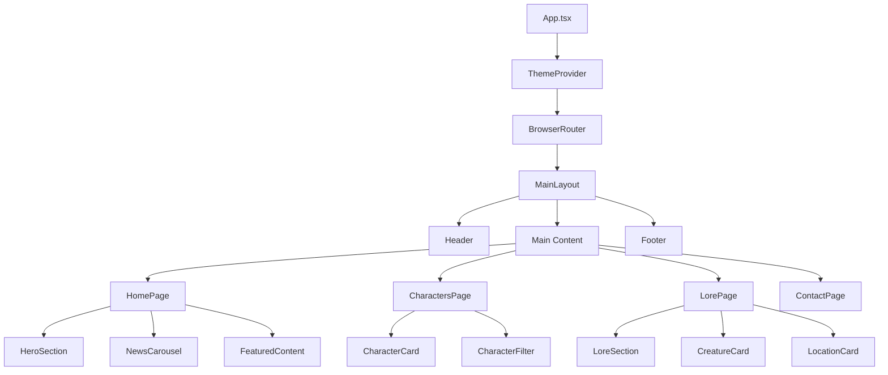

# Dragon Realm - Arquitetura do Projeto

## Visão Geral
Site RPG temático medieval com dragões e magia, desenvolvido com React, Material UI 7 e Tailwind CSS.

## Arquitetura de Componentes



## Estrutura de Pastas

```
dragon-realm/
├── public/
│   ├── images/
│   │   ├── dragons/
│   │   ├── characters/
│   │   ├── locations/
│   │   └── ui/
│   └── favicon.ico
├── src/
│   ├── assets/
│   │   ├── images/
│   │   ├── icons/
│   │   └── sounds/
│   ├── components/
│   │   ├── ui/
│   │   │   ├── Button.tsx
│   │   │   ├── Card.tsx
│   │   │   ├── Input.tsx
│   │   │   ├── Modal.tsx
│   │   │   └── Typography.tsx
│   │   ├── common/
│   │   │   ├── Header.tsx
│   │   │   ├── Footer.tsx
│   │   │   ├── Navigation.tsx
│   │   │   └── LoadingSpinner.tsx
│   │   └── sections/
│   │       ├── HeroSection.tsx
│   │       ├── CharacterCard.tsx
│   │       ├── NewsCarousel.tsx
│   │       └── ContactForm.tsx
│   ├── layouts/
│   │   └── MainLayout.tsx
│   ├── pages/
│   │   ├── HomePage.tsx
│   │   ├── CharactersPage.tsx
│   │   ├── LorePage.tsx
│   │   └── ContactPage.tsx
│   ├── hooks/
│   │   ├── useTheme.ts
│   │   ├── useLocalStorage.ts
│   │   └── useScrollToTop.ts
│   ├── services/
│   │   ├── dataService.ts
│   │   └── apiService.ts
│   ├── contexts/
│   │   ├── ThemeContext.tsx
│   │   └── DataContext.tsx
│   ├── data/
│   │   ├── characters.json
│   │   ├── dragons.json
│   │   ├── locations.json
│   │   └── news.json
│   ├── styles/
│   │   ├── theme.ts
│   │   ├── globals.css
│   │   └── components.css
│   ├── utils/
│   │   ├── formatters.ts
│   │   ├── validators.ts
│   │   └── constants.ts
│   ├── types/
│   │   ├── character.ts
│   │   ├── dragon.ts
│   │   └── common.ts
│   ├── App.tsx
│   ├── main.tsx
│   └── index.css
├── package.json
├── vite.config.ts
├── tailwind.config.js
├── postcss.config.js
└── tsconfig.json
```

## Paleta de Cores - Dragon Realm

### Cores Principais
- **Primária (Sangue de Dragão)**: `#A30000` - Vermelho escuro para ações principais
- **Secundária (Ouro Élfico)**: `#FFD700` - Dourado para destaques e elementos mágicos
- **Neutro Escuro (Noite Eterna)**: `#1A1A1A` - Fundo principal
- **Neutro Claro (Névoa Matinal)**: `#E0E0E0` - Texto e fundos secundários
- **Destaque (Floresta Encantada)**: `#4CAF50` - Verde para elementos interativos

### Cores Temáticas Adicionais
- **Fogo de Dragão**: `#FF4500` - Para elementos de fogo/magia
- **Gelo Ancestral**: `#87CEEB` - Para elementos de gelo/água
- **Sombra Profunda**: `#2F2F2F` - Para bordas e sombras
- **Luz Divina**: `#F5F5DC` - Para elementos sagrados/curativos

## Tipografia

### Fontes Principais
- **Títulos**: `Cinzel Decorative` - Fonte ornamentada para títulos épicos
- **Corpo**: `Inter` - Fonte moderna e legível para conteúdo

### Hierarquia Tipográfica
- **H1**: 3rem (48px) - Títulos principais
- **H2**: 2.5rem (40px) - Títulos de seção
- **H3**: 2rem (32px) - Subtítulos
- **H4**: 1.5rem (24px) - Títulos de cards
- **Body**: 1rem (16px) - Texto padrão
- **Caption**: 0.875rem (14px) - Legendas e textos pequenos

## Componentes Principais

### Layout Components
- **MainLayout**: Layout principal com header, main e footer
- **Header**: Navegação principal com logo Dragon Realm
- **Footer**: Informações de copyright e links sociais

### UI Components
- **Button**: Botões estilizados com variações (primary, secondary, ghost)
- **Card**: Cards para personagens, dragões e localizações
- **Modal**: Modais para detalhes de personagens e confirmações
- **Typography**: Componente para gerenciar estilos de texto

### Page Components
- **HomePage**: Página inicial com hero section e destaques
- **CharactersPage**: Galeria de personagens com filtros
- **LorePage**: História do mundo, criaturas e localizações
- **ContactPage**: Formulário de contato e informações

## Dados Mock - Dragon Realm

### Personagens
- **Elara, a Guardiã da Luz** - Paladina protetora
- **Thorin Forjaferro** - Anão ferreiro mestre
- **Lyralei Ventolâmina** - Elfa arqueira
- **Grimjaw, o Bárbaro** - Guerreiro das montanhas

### Dragões
- **Pyrothane, o Ancião** - Dragão vermelho ancestral
- **Glacius Eternus** - Dragão de gelo das montanhas
- **Verdania** - Dragão verde da floresta
- **Umbra Mortis** - Dragão sombrio das profundezas

### Localizações
- **Fortaleza de Pedra Branca** - Capital do reino
- **Floresta dos Sussurros** - Floresta mágica élfica
- **Montanhas do Fim do Mundo** - Lar dos dragões
- **Cavernas Sombrias** - Masmorras perigosas

## Funcionalidades Principais

### Navegação
- Menu responsivo com links para todas as seções
- Breadcrumbs para navegação contextual
- Scroll suave entre seções

### Interatividade
- Cards com hover effects e animações
- Modais para detalhes de personagens
- Carrossel de notícias/destaques
- Formulário de contato funcional

### Responsividade
- Design mobile-first
- Breakpoints: 640px (sm), 768px (md), 1024px (lg), 1280px (xl)
- Imagens responsivas com lazy loading

### Performance
- Code splitting por rotas
- Lazy loading de componentes pesados
- Otimização de imagens
- Memoização de componentes

## Tecnologias Utilizadas

- **React 18** com TypeScript
- **Vite** para build e desenvolvimento
- **Material UI 7** para componentes base
- **Tailwind CSS** para estilização utilitária
- **React Router DOM** para roteamento
- **Phosphor Icons** para ícones temáticos

## Próximos Passos

1. Configurar projeto base com Vite
2. Instalar e configurar todas as dependências
3. Criar estrutura de pastas
4. Implementar tema personalizado
5. Desenvolver componentes base
6. Criar dados mock temáticos
7. Implementar páginas principais
8. Adicionar responsividade e acessibilidade
9. Otimizar performance
10. Preparar para deploy